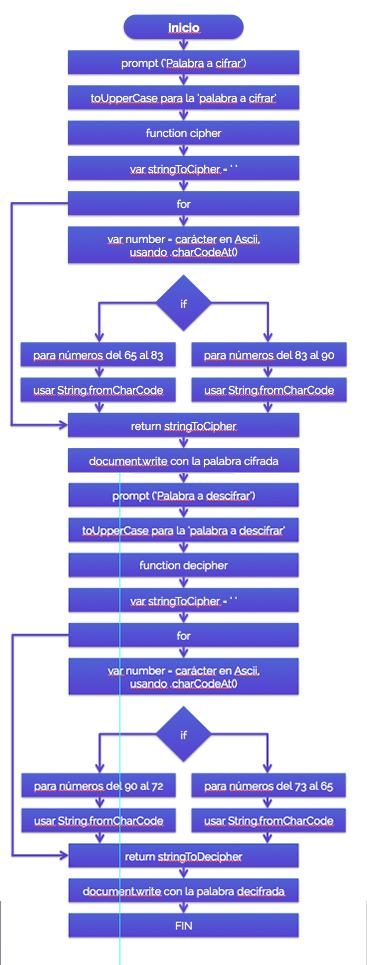

### Caesar cipher.

## Cifrado
1. Pedir por medio de un prompt(), una palabra al usuario.
2. Crear una variable que cambie el resultado que nos dio el usuario a mayúsculas por medio de toUpperCase().
3. Crear la función cipher, que tenga como parámetro la palabra que pedimos al usuario (strToCipher).
4. Asignarle a una nueva variable llamada stringToCipher, el valor de un string vacío.
5. Poner un for que nos ayude a recorrer el string de la palabra a cifrar.
6. Dentro de ese for, situar una variable llamada number, que nos dará el lugar de un carácter dentro de la tabla Ascii, usando el método .charCodeAt().
7. Colocar la condicional if, que nos de el número dentro Ascii, que corresponda a cada caracter que este recorriendo el for. Aquí especificamos que se considere del número 65 al 83, porque de lo contrario nos dará carácteres fuera del abecedario dentro de Ascii.
8. Por medio del método String.fromCharCode()cambiar el número que nos han arrojado al carácter que le pertence y sumarle 7 espacios para empezar a encriptar.
9. Crear un else if donde nos de los números de los carácteres que le daran la vuelta al abecedario, del número 83 al 90.
10. Aplicar el método String.fromCharCode() para cambiar el número que nos han arrojado al carácter que le pertence y restarle 19 espacios para que empiece encriptar.
11. Retornar el for con la variable stringToCipher.
12. Hacer un document.write de la función cipher(strToCipher).
13. FIN.

## Descifrado
1. Pedir por medio de un prompt(), una palabra al usuario.
2. Crear una variable que cambie el resultado que nos dio el usuario a mayúsculas por medio de toUpperCase().
3. Crear la función decipher, que tenga como parámetro la palabra que pedimos al usuario (strDecipher).
4. Asignarle a una nueva variable llamada stringToDecipher, el valor de un string vacío.
5. Poner un for que nos ayude a recorrer el string de la palabra a cifrar.
6. Dentro de ese for, situar una variable llamada number, que nos dará el lugar de un carácter dentro de la tabla Ascii, usando el método .charCodeAt().
7. Colocar la condicional if, que nos de el número dentro Ascii, que corresponda a cada caracter que este recorriendo el for. Aquí especificamos que se considere del número 90 al 72, porque de lo contrario nos dará carácteres fuera del abecedario dentro de Ascii.
8. Por medio del método String.fromCharCode()cambiar el número que nos han arrojado al carácter que le pertence y restarle 7 espacios para empezar a desencriptar.
9. Crear un else if donde nos de los números de los carácteres que le daran la vuelta al abecedario, del número 73 al 65.
10. Aplicar el método String.fromCharCode() para cambiar el número que nos han arrojado al carácter que le pertence y sumarle 19 espacios para que empiece encriptar.
11. Retornar el for con la variable stringToDecipher.
12. Hacer un document.write de la función decipher(strDecipher).
13. FIN.

