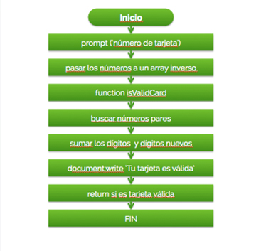

## Valid Credit Card.

1. Preguntar por el número de la tarjeta.
2. Pasar los números a un array en orden inverso, usando .split() y .reverse()
3. Crear una función llamad isValidCard.
4. Aplicar la operación a los números de las posiciones pares.
5. Sumar los dígitos y nuevos dígitos.
6. Crear un document.write para decir ‘Tu tarjeta es válida’.
7. Retornar si es una tarjeta válida.
8.FIN.

